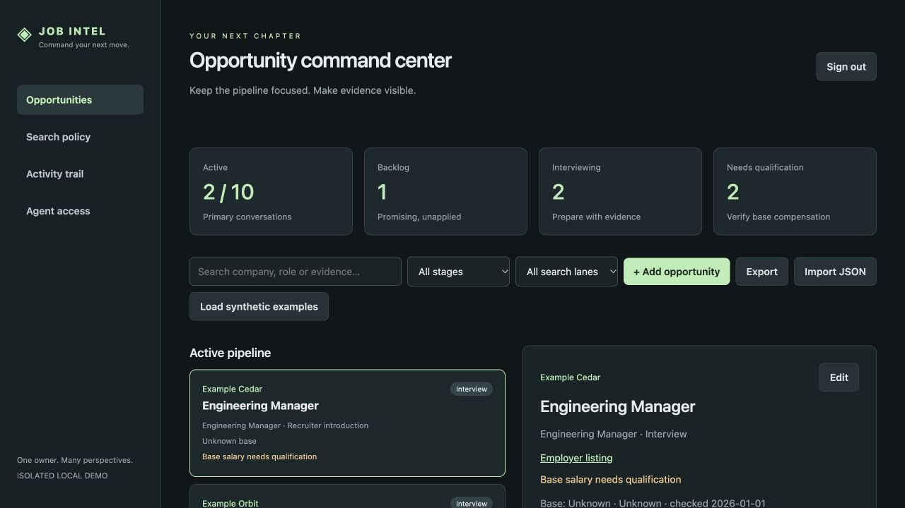
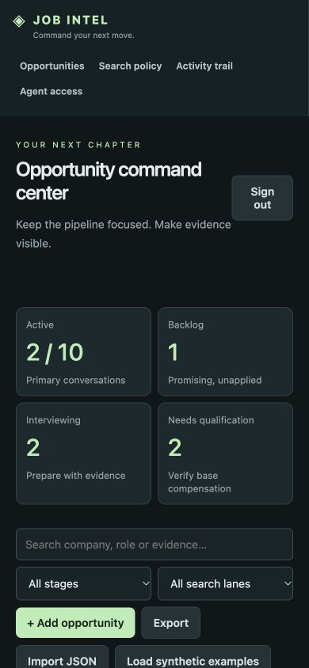

# Verification evidence

All data used in tests/screenshots is synthetic. No live Apple, agent credentials, private job search data, deployment, DNS change or external communication was used.

## Automated checks

Integration coverage includes unauthenticated resources and exports, session CSRF/origin checks, production demo rejection, agent scope/job isolation, author isolation, owner decision fields, revoked/expired credentials, attribution audit, version conflicts, idempotency collisions/retries, attachment allowlist/signature/path sanitization/download authorization, capacity races, employer primary/alternative rules, provenance validation, backup/restore and MCP forwarding errors.

Apple protocol tests generate temporary inert RSA/EC keys: code exchange is mocked but ID token verification is real. Valid token succeeds; wrong issuer/audience/owner-sub/nonce/expiry/signature and state/replay fail. Secure/SameSite=None callback-flow cookie and Secure/HttpOnly session flags are asserted. Live Apple service/account eligibility, actual callback browser policies and production proxy/TLS are untested and must pass the documented live protocol.

Local: pytest, ruff lint/format, mypy, JavaScript syntax compilation and Python sdist/wheel build. Local Docker daemon was unavailable; the GitHub CI workflow builds the Docker image separately. CI results must be read for the exact published commit before declaring image verification.

## Actual browser QA

Used the connected in-app browser against a loopback-only isolated demo:

- Login/empty state; synthetic examples render active/backlog, salary confidence and preserved titles.
- Repeated example loading retains three jobs without duplicates.
- Selected details; a duplicated-controls async race was identified and fixed with generation checks, then reverified.
- Created a note containing ``; displayed as literal text with no execution.
- Began editing a title then cancelled; persisted original title remained.
- Search reduced list to the matching synthetic employer.
- Saved editable structured search policy.
- Changed a recruiter-intro job from Screening to Interview; detail and board changed, timeline preserved both states and attribution.
- Edited a note and verified its version increased; uploaded the same synthetic material twice and verified v1/v2.
- Imported the synthetic example, retried the import and confirmed zero duplicates; authenticated export downloaded successfully; logout returned to the locked login state.
- An initial blob export did not download in the browser; replaced it with a direct authenticated attachment response and verified the download.
- Mobile viewport 390×844: responsive navigation/stats/filters render; page scrollWidth equals viewport width (390), no horizontal overflow. Viewport reset after test.

Independent read-only review found a caller-supplied parent scope bypass and missing create-time owner exception protection. Both were fixed and covered by regression tests before publication. This is scoped code review, not a security certification.

Locked production-mode localhost UI verified with no Apple settings: private workspace screen, no demo entry, unavailable Apple setup message; screenshot locked-deployment.png. Enrollment integration tests use inert capability fixtures and ephemeral signing keys, never live Apple credentials.

## PostgreSQL and Google feature verification (October 10, 2026)

Current local feature checks use synthetic fixtures only. SQLite: 142 passed, one PostgreSQL-only migration test skipped. PostgreSQL 14: 140 passed, two SQLite-only checks skipped, the SQLite backup test deselected; this includes a read-only SQLite migration rehearsal with preserved records/history/agent scopes/files and nonempty-target rejection. Full parity covers concurrent credential-name issuance, versions/idempotency, queue claims/outbox, owner/agent restrictions, Apple compatibility and Google state/nonce/issuer/audience/signature/expiry/authorized-party/replay/non-owner rejection. Google token exchange/JWKS are mocked; JWT signing and validation are real.

Mobile: vendor verification, TypeScript, ESLint, 126 Jest tests across 18 suites and four scene-plugin tests pass; two opt-in local-contract suites remain skipped. Apple and Google selection use the same native PKCE/confirmation/session flow. Server web authentication routes and all five browser-script syntax checks pass. No new interactive browser, simulator, signed iOS/Android or live provider acceptance was performed. Expo web live mode remains unsupported and locked.

Ruff lint/format, mypy and Python sdist/wheel packaging pass. Local Docker image/runtime checks are unrun because the daemon is stopped. Expo dependency compatibility uses the installed offline SDK map; authoritative online validation was unavailable. No native bundle export/build was created during this feature work. PostgreSQL CI was added but has not run remotely; these changes have not been pushed.

Live setup requires an approved Google web OAuth client, private client secret, exact HTTPS callback and independently verified operator-approved Google subject, followed by provider and signed-device acceptance. No live credentials, production records, settings or deployment were used. See [Google setup](GOOGLE_SETUP.md) and [PostgreSQL setup](POSTGRES_SETUP.md).
